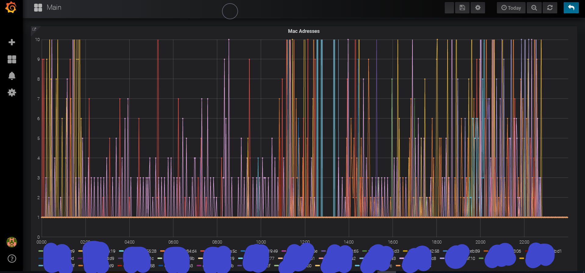
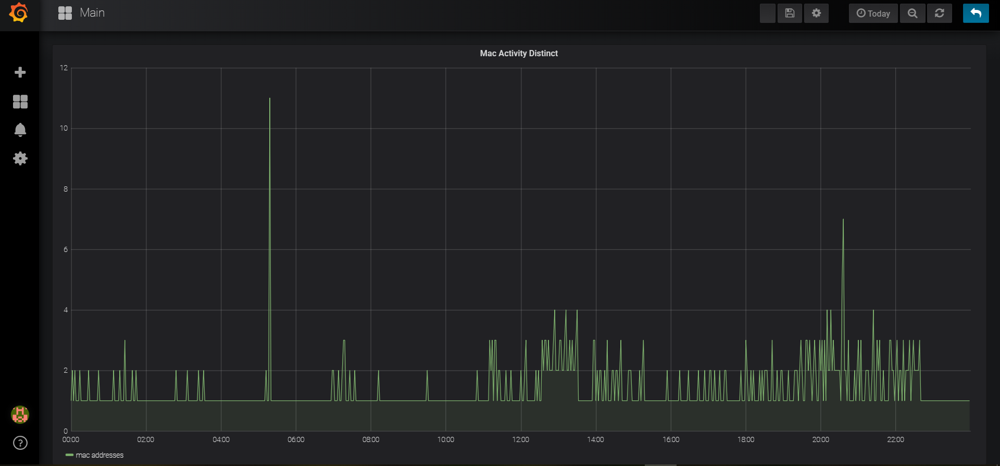

# WifiActivity Logger

The WifiActivity Logger is a Python Script which monitors, progresses and eventually saves incoming Probe Requests in a mysql Database.

## Setup

#### Raspberry Preperation

1. Install [the Kernal Hack](https://null-byte.wonderhowto.com/how-to/enable-monitor-mode-packet-injection-raspberry-pi-0189378/ "the Kernal Hack") from  re4son.

2. Follow [this Tutorial ](https://medium.com/@aallan/adding-a-second-wireless-adaptor-to-a-raspberry-pi-for-network-monitoring-c37d7db7a9bd "this Tutorial ") to set your raspberries wifi chip's mode to monitor.

#### Installation

Install the following dependencies:
> json
pyshark
sqlite3
datetime
argparse
threading
traceback
random
pymysql
urllib.request as urllib2

start the program via `bash startup.sh`

#### Data Visualisation

With [Grafana](https://grafana.com/ "Grafana") you can easilly visualize even big datasets, below you will find the SQL commands to visualize the saved data properly.

**Mac Address Graph**

SQL:
`SELECT
  $__timeGroupAlias(date,$__interval,1),
  count(mac_add) AS "mac addresses",
  mac_add AS "mac addresses"
FROM mac_add_data
GROUP BY 1
ORDER BY $__timeGroup(date,$__interval,1)`

**Mac Activity Graph**

SQL:
`SELECT
  $__timeGroupAlias(date,$__interval,1),
  count(DISTINCT(mac_add)) AS "mac addresses"
FROM mac_add_data
GROUP BY $__timeGroup(date,$__interval,1)`
